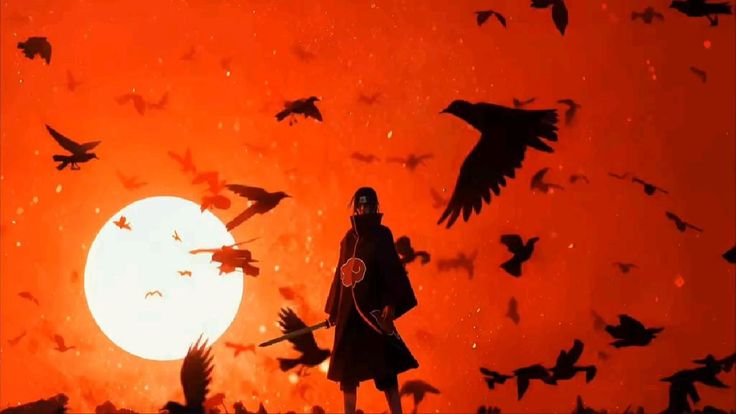

<!--
================================================================================
███╗   ██╗ █████╗ ██████╗ ██╗   ██╗████████╗ ██████╗ 
████╗  ██║██╔══██╗██╔══██╗██║   ██║╚══██╔══╝██╔═══██╗
██╔██╗ ██║███████║██████╔╝██║   ██║   ██║   ██║   ██║
██║╚██╗██║██╔══██║██╔══██╗██║   ██║   ██║   ██║   ██║
██║ ╚████║██║  ██║██║  ██║╚██████╔╝   ██║   ╚██████╔╝
╚═╝  ╚═══╝╚═╝  ╚═╝╚═╝  ╚═╝ ╚═════╝    ╚═╝    ╚═════╝ 
================================================================================
Welcome to your Ultimate Naruto-Themed GitHub Profile README!
================================================================================
-->

  <!-- 
  ========================================================
  TOP ANIMATED BANNER (SCALES PERFECTLY TO 100% WIDTH)
  ======================================================== 
  -->
  

    
  
  <!-- 
  ========================================================
  DYNAMIC GITHUB PROFILE PICTURE WITH NINE-TAILS GLOW
  ======================================================== 
  -->
  

    

  <!-- 
  ========================================================
  PROFILE VIEWS SCROLL (VISITOR COUNTER)
  ======================================================== 
  -->
  

    

  # 🍃 Hi there, I'm ARC (Naitik) 🍃
  ### 🇮🇳 Full-Stack Shinobi & Creative Modder from India

   

  <!-- 
  ========================================================
  NINJA-THEMED ANIMATED TYPING TEXT
  ======================================================== 
  -->
  

    

  <!-- 
  ========================================================
  ALLIED SHINOBI FORCES (SOCIAL BADGES - NO EMAIL)
  ======================================================== 
  -->
  

    
    
  

 

<!-- ANIMATED KUNAI DIVIDER -->

  

### 📜 My Ninja Way (Current Arc)

<table>
  <tr>
    <td width="65%" valign="top">
       
      
  * 🗡️ **S-Rank Missions:** Leveling up client-side Minecraft Fabric mods (like **Waydot** & **Helper** for 1.21.11).
  * 🌀 **Chakra Control:** Experimenting with custom Markdown renderers and scalable backend architectures.
  * 📜 **Ninjutsu Arsenal:** Writing clean jutsu in Google Antigravity IDE and VS Code.
  * 👁️ **Visual Prowess:** Tweaking Flatpak Spicetify and ricing my Fedora KDE Plasma setup to aesthetic perfection.
  * 🤝 **Team 7:** Feel free to reach out on Discord about collaborations, tools, or open-source projects!
    </td>
    <td width="35%" align="center">
      <!-- 
      ========================================================
      SIDE IMAGE 
      ======================================================== 
      -->
      
    </td>
  </tr>
</table>

<!-- ANIMATED KUNAI DIVIDER -->

  

### 🏅 Chunin Exams: Top Ninja Languages

  

 

### 🛠️ Ninja Tools & Elements (Tech Stack)

  <b>Languages & Core Elements</b> 
    
  
  <b>Frameworks & Summonings</b> 
    
  
  <b>Environment & Hidden Villages</b> 
  

 

<!-- ANIMATED KUNAI DIVIDER -->

  

### 🌟 Completed Missions (Featured Projects)

  <table width="100%">
    <tr>
      <td width="50%" align="center">
        <b>⭐ MD-Renderer-Template</b> 
        <i>Custom Markdown rendering engine template</i>  
        
      </td>
      <td width="50%" align="center">
        <b>⭐ SafeKey</b> 
        <i>Secure cryptographic & key utilities</i>  
        
      </td>
    </tr>
  </table>

 

### 📊 Combat Analytics (GitHub Stats)

  
  

  

 

### 🐍 Orochimaru's Contribution Snake

  <i>"True power is forged day by day in the contribution matrix..."</i>
    
  <picture>
    <source media="(prefers-color-scheme: dark)" srcset="https://raw.githubusercontent.com/ARCns09/ARCns09/output/github-contribution-grid-snake-dark.svg">
    <source media="(prefers-color-scheme: light)" srcset="https://raw.githubusercontent.com/ARCns09/ARCns09/output/github-contribution-grid-snake.svg">
    
  </picture>

 

<!-- 
========================================================
BOTTOM ANIMATED BANNER (WIDTH LOCKED TO 100%)
======================================================== 
-->

  

 
